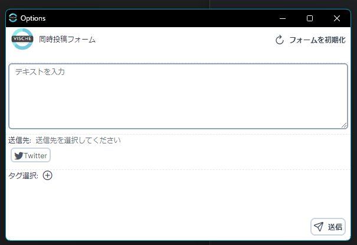

# Sync-form-hub

Vtuberの配信実況に特化した、YouTubeとTwitterに同時投稿を行う独自のフォームを追加するChrome拡張機能です。  

## 注意

本機能は開発中につき動作が不安定です。  
ブラウザクラッシュなどが発生する場合があります。  
予めご了承ください。  

## ベース

[vitesse-webext](https://github.com/antfu/vitesse-webext)  
開発者向けの詳しい内容については上記を参照してください。

## 動作確認済み環境

- GoogleChrome バージョン: 122.0.6261.112
- Vivaldi	6.6.3271.48

Chromiumベースのブラウザであれば動作すると思いますが、動作保証はできません。

## 導入方法

※事前にYouTubeを開いているタブがあれば閉じてください。

1. relese より ZIPファイルをダウンロード
2. ダウンロードしたファイルを任意のフォルダに展開
3. GoogleChrome（またはChrome拡張機能に対応したブラウザ）で chrome://extensions/ を開く
4. デベロッパー モードを有効化し、「パッケージ化されていない拡張機能を読み込む」で、展開したフォルダ（manifest.jsonがある階層）を読み込む
5. 追加された拡張機能アイコンを開く

## 利用方法

### 確認
導入が成功すると、ウィンドウ上部に拡張機能が追加されます。  

### ポップアップ

追加されたアイコンをクリックすると、下記のようなポップアップ画面が開きます。  

ポップアップ画面では下記の操作が可能です。
- フォームを開く：   
  機能の核となる投稿フォームを開きます。  
  新規ウィンドウ（ブラウザによっては別ウィンドウ）で画面が開きます。

- Twitterログイン：  
  Twitterにも同時投稿を行う場合、予め投稿したいTwitterアカウントでログインしておく必要があります。  
  未ログインの場合、このボタンからログインを行ってください。  
  （ログインした後はTwitterの画面は閉じて大丈夫です。）

- 概要欄自動展開オプション：  
  YouTubeからハッシュタグを取得するため、YouTubeの動画枠を開いた際に自動で概要欄を展開します。  
  ONの場合、概要欄に記載されたタグ情報を自動で取得できます。

- 機能の初期化：  
  動作が不安定なため、異常終了などが発生した場合ブラウザのストレージ領域に不要なデータが残る可能性があります。  
  タブを開いていないのにフォーム上に情報が表示されている場合、こちらのボタンで初期化を行ってください。

### フォーム
フォームでは下記のような操作が可能です。  

- テキストを入力：  
  投稿したいテキストを入力します。  
  Twitter・YouTubeにはそれぞれ文字数制限がありますがここでは現状制限していないのでご注意ください。 

- 送信先：  
  投稿したいTwitter・YouTube枠を選択します。  
  YouTube枠は開いているページを自動で取得します。  

- タグ選択：  
  Twitterに投稿する内容に付与するタグを選択できます。  
  開いているYouTube枠とVischeのデータベースからある程度自動でタグを抽出して表示します。  
  ＋ボタンを押下して独自のタグも追加できます。※永続化はしていません

- 送信  
  入力内容を選択された送信先に投稿します。  
  このボタンを押下、または CTRL+Enter の入力でも投稿可能です。  

  このとき、Twitterのウィンドウが開きますが、正常に投稿できれば自動で閉じます。  

## 異常が発生した場合

予期せぬ動作によりブラウザの動作が著しく重くなり、操作不可になる現象が発生する場合があります。  
その場合、タスクマネージャーからブラウザを強制終了し、ダウンロードした拡張機能のフォルダを削除することで機能が削除できます。  